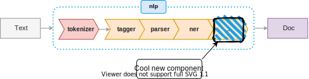

# Shipping with SpaCy

When it comes to Natural Language Processing, I am a huge [SpaCy](https://spacy.io/) fangirl. The library is easy to use, and the pretrained models produce great results. Beyond the existing components like Dependency Parsing and Named Entity Recognition, the library makes it easy to add custom processing steps: from [tagging additional entities using regular expressions](https://spacy.io/usage/rule-based-matching#regex) to [adding custom sentence boundary rules](https://spacy.io/usage/linguistic-features#sbd-custom) to [adding prefixes for a PERSON NER](https://spacy.io/usage/rule-based-matching#models-rules-ner). 

While SpaCy provided documentation for the various use-cases, I could not an explanation for how to package these with the model. For all the examples above, the new components were added using `nlp.add_pipe(NEW_COMPONENT)`, which modifies the existing model object with a new layer.While this set-up makes sense for experimentation, for production projects, I wanted the additional layers packaged in with the model, so I could just call `spacy.load` and have my new components available.

There is not an official approach for doing this, so in this tutorial I will outline the strategy that I used to "package" new components into a model. For this tutorial, I will focus on adding new layers to an existing model (I will touch on working with custom models at the end of this post).



## Set-up

First, we need to get a copy of an existing model SpaCy publishes the official models on github as [releases](https://github.com/explosion/spacy-models/releases/). I will take the [medium English model](https://github.com/explosion/spacy-models/releases/download/en_core_web_md-2.3.1/en_core_web_md-2.3.1.tar.gz) and untar it into a new folder (`cool_new_model`). The directory will look like:

```
en_core_web_md-2.3.1
    ├── meta.json 
    ├── setup.py
    ├── en_core_web_md/
        ├── __init__.py
        ├── en_core_web_md-2.3.1/ <-- "actual model"
            ├── ner
            ├── parser
            ├── tokenizer
            ├── ...
 
```

The files in the inner "actual model" folder contain the pre-trained components, we will not be touching these. Our work will focus on the `meta.json` and `__init__.py` files.

The `meta.json` file is heart of a SpaCy model. It defined everything from documentation (`author`, `sources`..) to the accuracy of the trained model to the model definition itself `pipelines`. 

## Renaming the Model

The `name` in `meta.json` the name of the new model, this is string that you pass into `spacy.load`. While you can stick with the existing name (`core_web_md`), a new name can be helpful for distinction. We will change it to `web_custom_md`, the we will rename the directory structure to match.

```
en_web_custom_md-2.3.1
    ├── meta.json 
    ├── setup.py
    ├── en_web_custom_md/
        ├── __init__.py
        ├── en_web_custom_md-2.3.1/ <-- "actual model"
            ├── ner
            ├── parser
            ├── tokenizer
            ├── a couple of other things..
 
```

The `2.3.1` field corresponds to the `version` in `meta.json`, you could change it to something new (e.g `1.0` since this is the first version of your custom model`). The `en` is not part of the name field, because it is already specified in the `language` field. In general, Spacy uses the Language to specify some basic parsing rules, regardless of what model is used for the remaining components.

## Defining New Components

Next, we will add some new components. For simplicity, we will use the example from the SpaCy documentation that adds "titles" to an NER (e.g Ms. Kornilova). We will call this component `expand_person_entities`.

First, we add the code to the `__init__.py` file. Next, we need to tell SpaCy how to find the new component by modified the `Language.factories` component. We add the change to the `load` method. The resulting file will look like:

```python
from __future__ import unicode_literals
from pathlib import Path

from spacy.util import load_model_from_init_py, get_model_meta
from spacy.language import Language
from spacy.tokens import Span


__version__ = get_model_meta(Path(__file__).parent)['version']


def load(**overrides):
    Language.factories['expand_person_entities'] = lambda nlp, **cfg: expand_person_entities

    return load_model_from_init_py(__file__, **overrides)

def expand_person_entities(doc):
    new_ents = []
    for ent in doc.ents:
        # Only check for title if it's a person and not the first token
        if ent.label_ == "PERSON" and ent.start != 0:
            prev_token = doc[ent.start - 1]
            if prev_token.text in ("Dr", "Dr.", "Mr", "Mr.", "Ms", "Ms."):
                new_ent = Span(doc, ent.start - 1, ent.end, label=ent.label)
                new_ents.append(new_ent)
            else:
                new_ents.append(ent)
        else:
            new_ents.append(ent)
    doc.ents = new_ents
    return doc
```

The same pattern can be used for full components:

```python
patterns = [] # Some Entity Matcher Patterns
Language.factories["entity_matcher"] = lambda nlp, **cfg: EntityMatcher(nlp, patterns=patterns)
```

See another example of a complex component [here](https://spacy.io/usage/examples#custom-components-entities).

[https://spacy.io/usage/processing-pipelines#custom-components-factories](Additional details on factories)

## Adding to the Pipeline

Now that SpaCy knows the definition for the new component, we need to add it to the model. To do this we modify the `pipeline` key in the `meta.json` class:

```json
  "pipeline":[
    "sentencizer",
    "tagger",
    "parser",
    "ner",
    "expand_person_entities"
  ]
```

In addition, we need to specify a new `factories` key with instructions for loading the components:

```json
  "factories":{
    "tagger":"tagger",
    "parser":"parser",
    "ner":"ner",
    "expand_person_entities": "expand_person_entities"
  }
```
## Build the Model

Finally, we build the new model package by calling `pip install -e .` in the top level folder. We can now load the new model by calling `spacy.load('en_web_custom_md')`. 

```
model = spacy.load(`en_core_web_md`)
list(model("Ms. Anastassia wrote this blog post").ents)
>>

model = spacy.load(`en_web_custom_md`)
list(model("Ms. Anastassia wrote this blog post").ents)
>>
```

You can package the model into a single file by running `python setup.py sdist`. This will produce the file `dist/en_web_custom_md-2.3.1.tar.gz` which can be installed directly with pip.

If you trained a new model (using the CLI or Prodigy), it may not have the set-up necessary to run this tutorial. In that case, you should call the [package](https://spacy.io/api/cli#package) method: `python -m spacy package input_model_path package_model_path`. After, the `package_model_path` should have the folder structure outlined in the beginning of the tutorial.

Do you have a different method for packaging models? Are there other SpaCy tips or tricks that you want me to go over? Drop a line in the comments!
